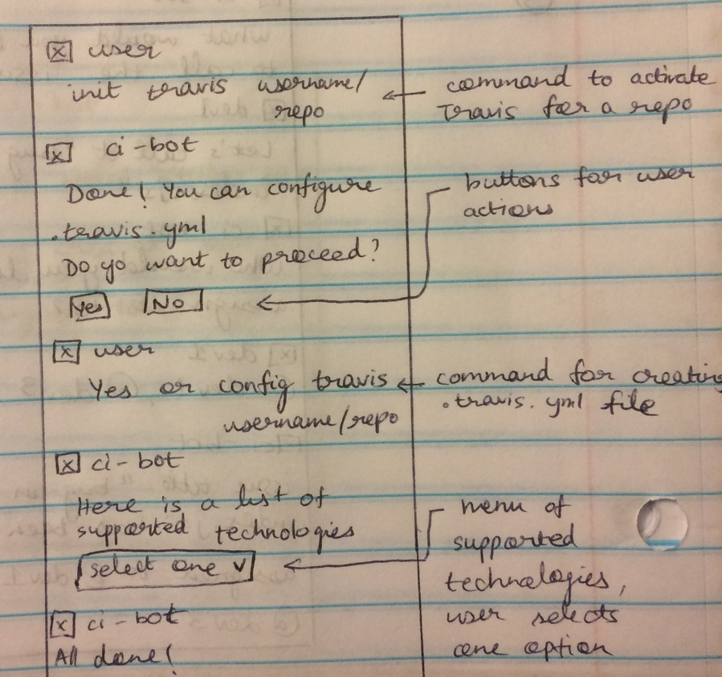
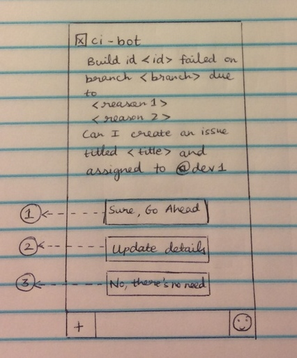
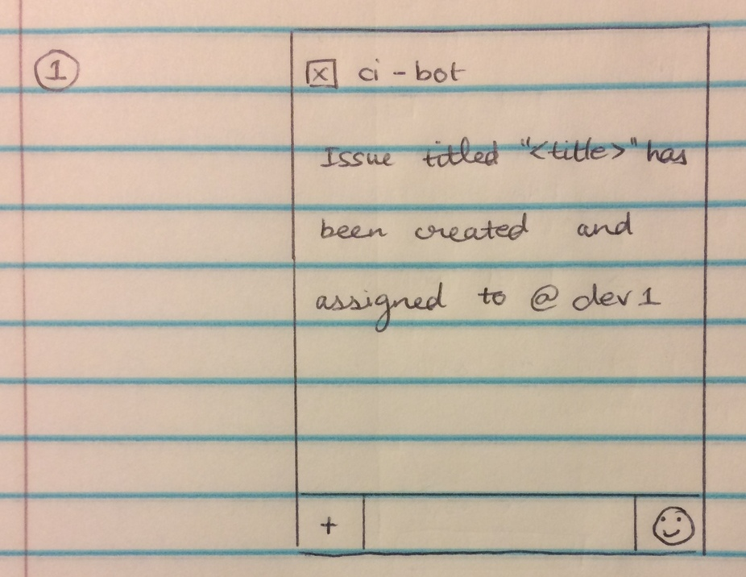
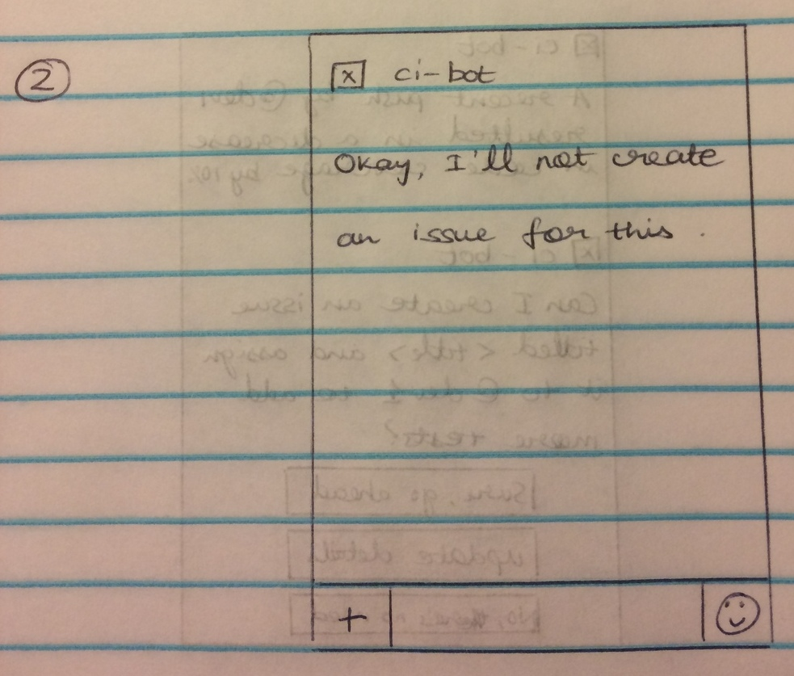
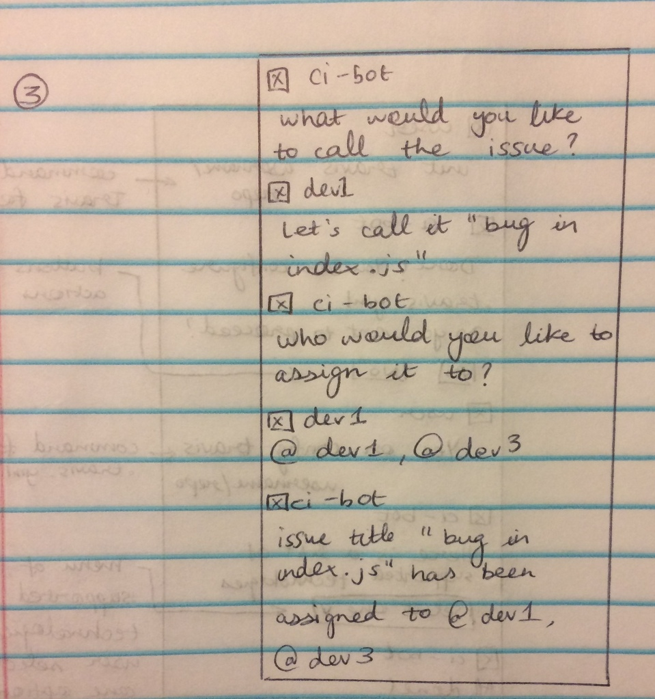
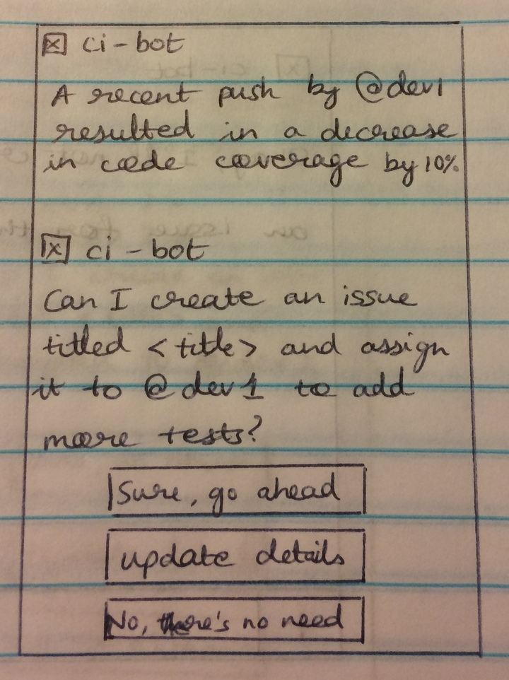
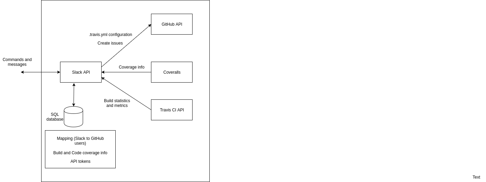

# Design Milestone

## 1. Problem Statement

Continuous integration (CI) is an approach to the software development process in
which disparate working branches are constantly merged with the master branch,
oftentimes with each incremental change or added feature.  One of the main advantages
of CI is that it avoids “integration hell,” a circumstance that arises from
individual team members working on separate branches for extended periods of time,
greatly increasing their chances of producing incompatible code that will take an
inordinate amount of time and effort to integrate.  CI tools typically facilitate
CI by performing automated builds of and tests on the code base, either at set
time intervals or in response to events such as pushes to or merges with the
master branch.  By successively performing builds and tests, CI allows bugs and
other errors to be discovered and resolved consistently throughout the development
process.  In this way, CI becomes a natural complement to test-driven development,
and allows stable, deployable code to be produced throughout the development cycle.

However, these advantages also come with a cost.  Due to the necessity of
formulating a strategy for the commit cycle of a project up front, there can be
higher time requirements for CI projects in the beginning phases than for non-CI
projects.  In the likely case that CI tools will be used for a project, this
initial time overhead is increased, as the tools themselves must be set up and
then customized for specific projects.  Many CI tools have sought to simplify
this initial setup process, but many only provide partial solutions.  Let us take
Travis CI, one of the most popular CI tools, as an example.  Through its GitHub
app, Travis CI has made account creation and activation as simple as logging into
their website your GitHub account, then clicking a button next to the repo that
you want to enable Travis CI services on.  At this point, however, any further
customization needs to be done through editing the .travis.yml file, and while
the documentation for doing so is fairly good, the process can still seem somewhat
arcane to novice users (in fact, it is one of the most [common complaints][1]
about Travis CI).  We’ll refer to this as CI’s “inaccessibility” problem.

Another barrier to using CI effectively results from the fact that CI is inherently
dependent upon the total participation of the contributors to a code base, their
adherence to a tightly-constrained commit cycle, and their willingness to pause
development to resolve errors as they occur.  This can lead to several undesirable
outcomes.  On the one hand, when a build fails, a project can grind to a halt as
team members shift focus away from their currently assigned tasks in order to
resolve the errors introduced into the code base.  On the other hand, if builds
fail regularly due to simple and easily-remedied mistakes, the entire team can
eventually abandon the CI approach entirely by simply ignoring the status of the
builds and continuing on with their work as the would otherwise.  Some have
argued that these outcomes [completely negate the usefulness of CI][2].  We’ll
refer to this as CI’s “rigidity” problem.

A third and final problem with CI is that it oftentimes relies upon a variety of
services and endpoints to function optimally, many of which are maintained from
completely separate user interfaces.  Even with services that are well-linked,
like Travis CI and GitHub, certain tasks still require searching back and forth
between the interfaces of the disparate tools.  It is often desirable to include
tools such as coverage analyzers or deployment platforms in the CI process, but
each added service effectively adds another layer of settings and configurations
for the users to keep track of and navigate through, discouraging developers from
taking full advantage of the benefits that CI could offer.  We’ll refer to this
as CI’s “decentralized workflow” problem.

If these problems of inaccessibility, rigidity, and decentralized work flow were
resolved, CI could be opened up to a broader base of users who are able to take
full advantage of its strengths and benefits.

[1]: https://www.g2crowd.com/products/travis-ci/reviews
[2]: http://www.yegor256.com/2014/10/08/continuous-integration-is-dead.html

## 2. Bot Description

We have chosen to address the stated problems of inaccessibility, rigidity, and
decentralized workflow through creating “CiBot” — a bot that integrates the
continuous integration services of Travis CI into Slack.  Slack is a good candidate
for our platform due to the fact that team members working on a project can
already easily coordinate through Slack channels and messages.  Integrating a bot
here allows for a centralized user interface for maintaining workflow and managing
multiple endpoints, and a chat platform provides a simple way for a bot to post
notifications and respond to natural-language commands.  We have chosen to use
Travis CI because it is currently one of the most popular CI tools, is free to
use for open-source projects, and has options to link its services to various
other tools for coverage analysis, deployment, and more.

**NOTE:** While there is already a [Travis CI bot for Slack][3], it is a simple
notifier that sends messages for build completions and pull requests, and does
not address the problems of continuous integration stated in the first section.

### INACCESSIBILITY:

***Setup is time-intensive and configuration options are arcane.***

To address the problem of increased time-cost in the beginning phases of CI
projects, as well as the initial learning curve of CI configuration, our bot would
provide a suite of easily-understood commands for automatically creating and
editing the .travis.yml file.  Our bot would be able to prompt the user with
certain questions about the integration environment they are creating, and would
respond accordingly with the proper output to the configuration file.  The user
would have the option of calling on the bot to edit the configuration file at any
time, making changes quickly and easily as the requirements of the environment
change.  The bot could also prompt users to save commonly used configurations for
future projects in a bank accessible to the bot, significantly reducing time cost
by eliminating the need to repeat identical processes.  We would likely limit
this feature to certain languages and environments as a proof-of-concept first,
and could expand the capabilities as time allows.

### RIGIDITY:

***Build failures can cause projects to halt or the build server status to be
ignored.***

To address the problem of halted progress due to build failures, our bot would
automatically parse any error messages produced by the build failure and return
them in a legible format to the members of the appropriate Slack channel, along
with any relevant metrics.  It would then ask the team if they would like to
[create a GitHub issue for the build failure][4], and if so, who should be
assigned to the issue.  The team would have the option to choose a “you break it
you fix it” model, where the bot would automatically assign these issues to the
last person who made a commit (i.e., the culprit of the build failure, and also
the person most likely to know what was changed and what went wrong), or
alternatively the team could choose to delegate the bug fix to another team
member.  The bot would also provide commands to close these issues and notify the
team when they have been resolved.  This feature would prevent the entire team
from halting their work on the project to track down the bug’s source — instead,
in the span of a few seconds, the cause of the build failure would be identified
and delegated, allowing other team members to continue their work while the
assignee resolved the problem, minimizing the temptation to drift from the CI
approach.

### DECENTRALIZED WORKFLOW:

***Adding helpful tools makes managing all these tools more complicated.***

To address the problem of maintaining separate tools from separate user interfaces,
we intend to extend Travis CI’s Slack integration to include commands for GitHub
and Coveralls (two of the most useful tools for a continuous integration project).  
While Travis CI’s integration with GitHub already enables some handy automation
(i.e., starting a build when certain conditions are met on a public repo), it does
not have the robustness of handling all the available tools of GitHub’s API, and
the same can be said of Coveralls.  By consolidating these tools into one user
interface in Slack, the task of managing these endpoints is greatly simplified.  
On a similar note, the bot can monitor and respond with information from these
additional services, providing legible messages concerning open issues, decreases
in coverage, or other items of note for the development team — and the team can
respond in kind within the same interface.

### Why a Bot?

A bot is a good solution to the stated problems of continuous integration because
they can all be solved by installing an intermediary between the user and Travis
CI, i.e., they can be solved with “service glue”.  In terms of the inaccessibility
problem, the bot takes advantage of its ability to act as a translator of sorts,
coordinating between human-readable commands and complex statements in the
.travis.yml file.  In the same case, the bot’s ability to recall previous
configurations from a stored bank keeps the user from doing the same thing twice.  
In terms of the rigidity problem, the bot can take advantage of monitoring and
automation to respond to events without prompting, immediately notify users, and
respond on their behalf on another platform, allowing for quick response times to
build failures and minimal interruption of team workflow.  In terms of the
decentralized workflow problem, the bot takes advantage of its ability to integrate
separate complex systems, providing a single interface for managing multiple
endpoints, while again providing user-friendly options that abstract complex
tasks into simple commands.

### What Kind of Bot?

In terms of design and categorization, this bot would be most similar to a Space
Reactor DevOps bot — it would respond both to user input and events occurring on
GitHub, Coveralls, and Travis CI, but would be limited to a single project per
Slack channel (a separate Slack channel can be created for each additional project).  
This segregation of projects into channels would allow for certain context-based
inferences (i.e., the specific GitHub repo in use, the corresponding Travis CI
configurations, and the deployment platform for that project) and enforce a
logical organization of projects.

[3]: https://slagit.slack.com/apps/A0F81FP4N-travis-ci
[4]: https://github.com/travis-ci/travis-ci/issues/7199

## 3. Use Cases

### 3.1 Configuring travis.yml

1. Precondition
    * User must have Github api token in the system
    * User needs to setup Github repo in Travis CI
    * User has created a Node.js public project on Github
2. Main flow

    User will request configuring the Travis and provide the name of public repo [S1].
    Bot asks for additional information that user must submit [S2]. Bot creates travis.yml
    file and pushes it to the repository [S3].
3. Subflows

    [S1] User provides /init travis command with name of repo

    [S2] Bot will return list of techs that it supports (ex: Node, Ruby, etc.). And user
    confirms them.

    [S3] Bot creates template travis.yml file and pushes it to the repository. The bot notifies
    the Slack channel.
4. Alternative flows
    * If the repository language is not supported, the bot will return an error message and
    gives the link for the Travis documentation.

### 3.2 Creating issue if the build fails
1. Precondition
  * User must have Github api token in system.
  * The build should lead to a failure
2. Main flow

  Travis CI notifies bot of build failure along with the reason and uid of developer who started the build.
  Bot notifies developer of the failure and reason.
  Bot asks the developer if the failure calls for an issue to be created immediately [S1], add a different title/update assignees [S2] or not create the issue [S3].
  The bot creates an issue on the appropriate github repository branch.
3. Subflows

  [S1] The bot will auto-generate an issue name and auto-assign it to the developer who started the build. If the user accepts the auto-generated details, the issue is created immediately

  [S2] The bot will ask the developer for the issue title and to assign different people to the issue. Once the user enters these details, the issue is created by the bot

  [S3] If the user does not want to create an issue, the bot would not go forward with issue creation
4. Alternative flows

### 3.3 Code coverage notifications
1. Precondition
User must have Coveralls api token in system.
Coveralls.io should be integrated with Travis CI
Test suites have required proper coveralls files
2. Main flow
  When a push is made, the bot checks the coveralls coverage report
  If a change is pushed resulting in a decrease in coverage, the bot will ask the developer if the failure calls for an issue to be created immediately [S2], add a different title/update assignees [S3] or not create the issue [S4].
  The bot will create an issue to implement necessary test cases for the delivered code
3. Subflows

  [S1] When setting up the bot, the developers have the ability to set the notification threshold

  [S2] The bot will auto-generate an issue name and auto-assign it to the developer who started the build. If the user accepts the auto-generated details, the issue is created immediately

  [S3] The bot will ask the developer for the issue title and to assign different people to the issue. Once the user enters these details, the issue is created by the bot.

  [S4] If the user does not want to create an issue, the bot would not go forward with the issue creation.
4. Alternative flows

## 4. Design Sketches

### Configuring .travis.yml

### Issue creation on build failure

### Code coverage notifications

## 5. Architecture Design

### Diagram

### Description

The bot runs off a Node .js server that would be hosted on a hosting platform such as Heroku.  
For each GitHub project, a dedicated Slack channel would be created which would allow users to communicate with the Slack bot and issue commands.  
The user interacts with the bot through the Slack interface which matches commands using the Slack API. The Slack bot handles different commands such as ‘configure Travis’. The bot creates the travis.yml template file, which can be edited by the user if the command is to configure builds.  
Whenever a push is made to the Git repo, the Travis CI build starts. The Travis CI API can then be used to extract information about the build such as start time, finish time, and build status. The Slack bot can make REST calls to the Travis CI and Coveralls APIs to obtain the statistics which can then be relayed to the user.  
The Slack bot code would handle creating GitHub issues if the build fails or if adequate tests are not delivered and if the user confirms the creation of the issue.

### Constraints

One of the major constraints is to design the communication interface between the APIs.  
Once the build starts after the push has been made, one possible design is to have the bot poll the Travis API for build stats. However, it would be more efficient to develop a notification mechanism by which the bot is notified when the build finishes and the stats can then be requested.  
The bot cannot manage multiple projects within a single conversation. If there are a lot of projects, you’d need to have  Slack channels for each of them.

### Design Patterns

The bot would use a combination of a Space Responder and a Notifier design pattern.  
The Space Responder pattern would be a suitable bot design pattern because the bot:
reacts to messages (commands such as ‘configure .travis.yml’)
maintains state and context (mappings between Slack and GitHub users, specific Slack channels for projects).  
The Notifier pattern would also be relevant because the bot sends notifications to the user regarding build failures and test coverage statistics.
